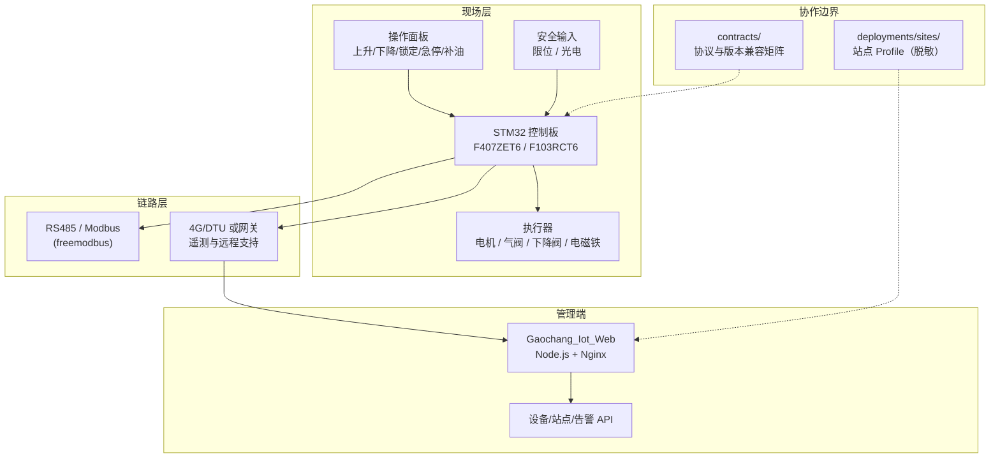
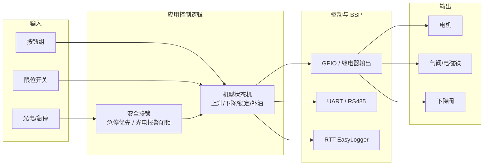

# Gc_Iot_Lift

高昌机电 · 汽车举升机物联网平台（固件 + Web）。

面向外部客户站点的举升机 IoT 产品仓：多机型 STM32 控制固件、Modbus/现场总线能力、以及 Node.js Web 管理端。  
公司权威镜像：`https://github.com/GcCarLifts/Gc_Iot_Lift`（本仓为个人工作副本时可双远程协作）。

## 系统架构图



## 固件功能框图



## 仓库结构

| 路径 | 说明 |
|------|------|
| `Gc_Iot_Lift/F407ZET6/` | F407 平台多机型固件 |
| `Gc_Iot_Lift/F103RCT6/` | F103 平台多机型固件 + 文档/工具 |
| `Gc_Iot_Lift/Gaochang_Iot_Web/` | 物联网 Web 管理端 |
| `freemodbus/` | Modbus 协议栈 |
| `kinco/` | 步进/伺服相关现场资料 |
| `contracts/` | 与控制板主档的兼容约定 |
| `deployments/` | 站点部署说明（脱敏 Profile） |
| `plan/` | 审查、交接与重构计划 |
| `逻辑.txt` | 各机型输入输出与时序要点 |

## 机型清单

| 目录 | 机型 |
|------|------|
| `GC_Big_Scissor` | 大剪举升机 |
| `GC_Small_Scissor` | 小剪举升机 |
| `GC_Thin_Scissor` | 超薄小剪举升机 |
| `GC-Two_Pillars` | 两柱举升机 |
| `GC-Screw_Lift` | 丝杆举升机 |

## 产品边界

- **本仓**：客户/站点侧举升机产品固件 Profile、遥测、告警、Web/API、受控部署。
- **`GcMultiLinkLift`**：板卡、Bootloader、OTA 与设备协议主档。
- **`GcFactoryIoT`**：工厂内部只读采集与语义模型。
- 共享协议通过 `contracts/` 版本矩阵协作，不直接合并三仓代码。

## 安全约定

- 不提交客户个人信息、设备密钥、MQTT 凭据、数据库导出、生产日志或现场配置原件。
- 站点 Profile 只保存脱敏结构与 `cred://` 引用；真实凭据进入 Bitwarden。
- 协议 / Topic / 升级路径变更须经测试设备验证与可回滚验收。

## 清理约定

- `RTT_easylog` 日志库源码必须保留。
- `*.log`、`rtt_capture*.txt`、`rtt_logger*.txt`、`jlink_*.txt`、测试 `out` 目录为临时输出，不长期保留。

## 本地远程

```text
origin   → https://github.com/linxi27667/Gc_Iot_Lift.git
company  → https://github.com/GcCarLifts/Gc_Iot_Lift.git
```
